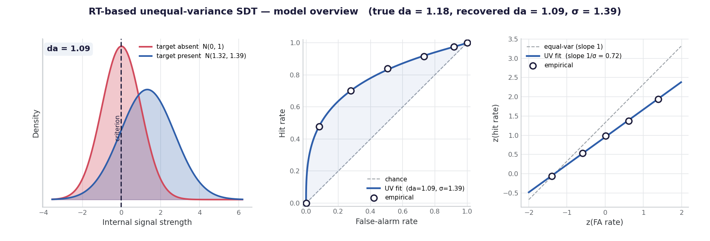
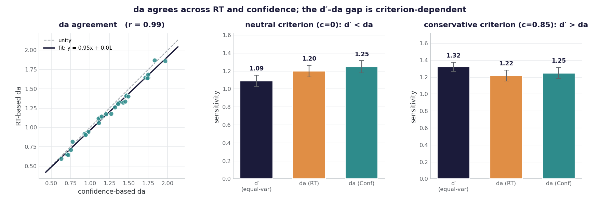
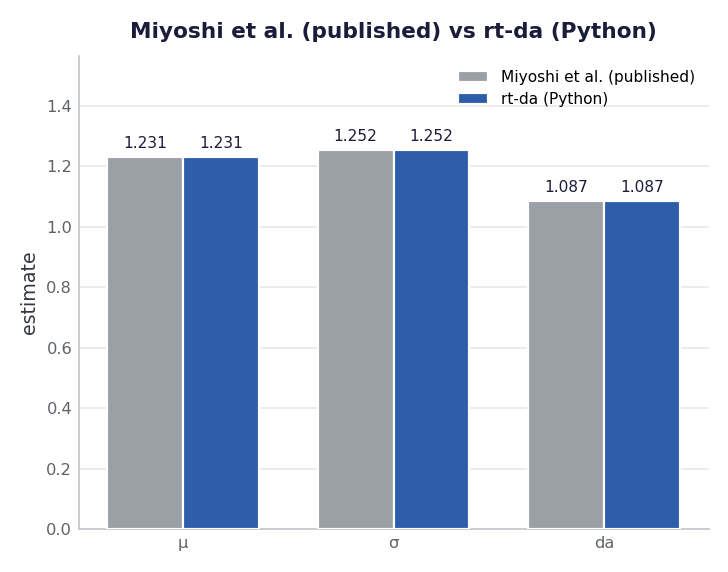
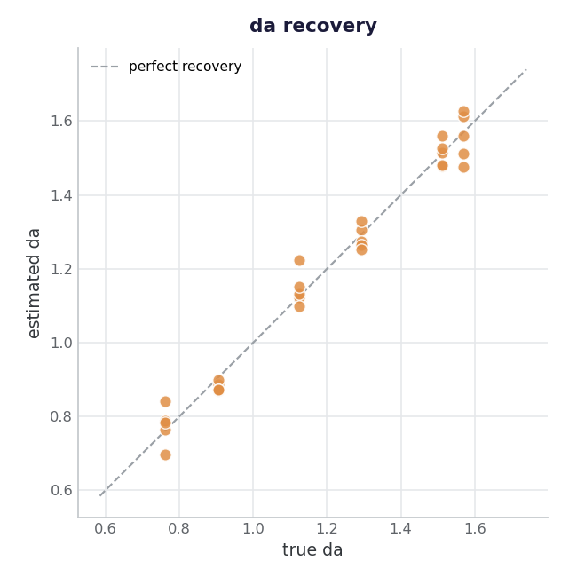

# rt-da

**RT-based unequal-variance signal detection (da) in Python.**

In a yes/no detection task, the target-present internal distribution is
usually *more variable* than the target-absent one (SD ratio σ > 1).
Conventional `d′` assumes equal variance and so **misestimates sensitivity in
a criterion-dependent way** (it can run above *or* below the true value
depending on where the criterion sits). The unequal-variance index `da`
fixes this:

```
da = μ / sqrt((1 + σ²) / 2)
```

Fitting `da` needs multiple points in ROC space (a single hit/false-alarm
pair only determines `d′`). Those points come either from manipulating
response bias across conditions — via payoffs or target prevalence — or,
within a single block, from a confidence-rating scale whose levels act as
multiple criteria (Macmillan & Creelman cover both). Either route needs a
bias manipulation or confidence ratings built into the design — which many
existing datasets simply don't have. This package estimates `da` from
**response times alone**, using *faster RT as a proxy for higher confidence*,
so you can get unequal-variance sensitivity from plain
stimulus / response / RT data. (If you *do* have confidence, it will fit that
too, and can compare the two.) Following:

> Miyoshi, K., Rahnev, D., & Lau, H. (2026). *Correcting for unequal variance
> in signal detection models using response time.* iScience 29, 114998.
> https://doi.org/10.1016/j.isci.2026.114998

This is an independent Python implementation. The authors' original R code is
at <https://github.com/kiyomiyoshi/rt_type1_roc>.



*The two internal distributions (target-absent vs target-present, σ > 1), the
type-1 ROC the model fits, and the z-ROC whose slope is 1/σ. The "empirical"
ROC points are **simulated** detection trials (n = 8000, μ = 1.5, σ = 1.5)
binned by RT — not real data; the curve is the unequal-variance model fit to
them. RT-based da runs slightly below the true value, as the method expects.*

---

## Overview

- **Python-native.** The reference implementation is R; this fits cleanly into
  PsychoPy / pandas / SciPy workflows.
- **Validated against the published method.** `fit_uvsdt_mle` reproduces the
  reference example *exactly*, and matches the authors' own R (`uvsdt.R`)
  per-subject **to optimizer precision** (da within 2.5e-3 across 80
  subject-fits) on the Mazor (2020) and Sherman (2016) datasets. See
  `validation/`.
- **Does more than the paper packages:** RT-validity diagnostics, bootstrap
  confidence intervals, tidy group-level batch fitting, and publication-style
  plots are all included.
- **Works with RT alone.** The main use case: estimate `da` from
  stimulus / response / RT, no confidence ratings needed. If confidence *is*
  available, the package can fit it too and report both side by side, and
  check whether RT tracks confidence in your data.



*All three panels use **simulated** subjects (30 simulated detection datasets).
Left: RT-based and confidence-based da agree closely across subjects (da is
criterion-invariant). Middle/right: the same simulated subjects refit under a
neutral (c = 0) and a conservative (c = 0.85) criterion. da barely moves, but
single-point equal-variance d′ swings from below da to above da purely from
where the criterion sits — which is why a criterion-free sensitivity index
like da is worth computing. When σ > 1, the sign of (d′ − da) is
criterion-dependent: d′ overestimates da at conservative criteria (the regime
emphasised in the paper) and underestimates it at neutral/liberal ones.*

## Install

```bash
pip install rt-da            # core (numpy, scipy, pandas)
pip install "rt-da[plots]"   # + matplotlib for the plotting helpers
```

## Quick start

The core workflow needs only stimulus, response, and RT (confidence optional):

```python
import rt_da

# Trial-level arrays: stimulus (1=present, 0=absent),
# response (1=yes, 0=no), rt (seconds)
fit = rt_da.rt_da(stimulus, response, rt, n_bins=3)
print(fit.da, fit.sigma, fit.mu, fit.dprime)

# Confidence intervals (RT only)
ci = rt_da.rt_da_ci(stimulus, response, rt, n_boot=2000)
print(ci["da"])   # (estimate, lo, hi)

# Batch over subjects in a tidy DataFrame (rt only; confidence optional)
table = rt_da.fit_group(df, subject="subj", stimulus="stim",
                        response="resp", rt="rt")
```

If you also collected confidence ratings, you can fit those and compare:

```python
# Fit confidence directly, or compare RT-based vs confidence-based da
dual = rt_da.compare_rt_confidence(stimulus, response, rt, confidence)
print(dual.summary())

# Sanity check: does RT actually track confidence here?
print(rt_da.rt_validity(rt, confidence))

# Batch with both modalities side by side
table = rt_da.fit_group(df, subject="subj", stimulus="stim",
                        response="resp", rt="rt", confidence="conf")
```

### Working directly with count vectors

If you already have the response-frequency vectors (S1 = target-absent,
S2 = target-present), ordered from highest support for "yes" to lowest:

```python
fit = rt_da.fit_uvsdt_mle(nr_s1, nr_s2, add_constant=True)
# -> SDTFit(mu, sigma, da, criteria, log_likelihood, ...)
```

## Validation

This package is validated against the published reference implementation
(Miyoshi et al.; kiyomiyoshi/rt_type1_roc) at two levels.

**1. The published example.** Fitting the reference's own published count
vectors reproduces their reported parameters to the printed digits:

```python
fit_uvsdt_mle([10,7,16,27,29,10], [43,21,10,12,8,3])
```

| parameter | Miyoshi et al. (published) | rt-da (Python) | abs. diff |
|-----------|---------------------------:|---------------:|----------:|
| μ         |                     1.2314 |         1.2314 |   < 1e-4  |
| σ         |                     1.2523 |         1.2523 |   < 1e-4  |
| da        |                     1.0867 |         1.0867 |   < 1e-4  |
| log L     |                   −315.88  |       −315.88  |   < 2e-3  |

Miyoshi et al. (published) = the parameters reported in the reference paper /
implementation (kiyomiyoshi/rt_type1_roc); rt-da (Python) = `fit_uvsdt_mle`
in this package, computed on the same count vectors.



*Miyoshi et al.'s published values and rt-da (Python) return the same μ, σ,
and da on the published example — the bars are indistinguishable.*

**2. Per-subject estimates on real datasets, against the authors' own R.**
The `validation/` suite refits the Mazor (2020) and Sherman (2016) datasets
and checks each subject's μ, σ, da, and log-likelihood against the values
produced by the authors' `uvsdt.R` on the identical count vectors. Across
**80 subject-fits** (RT and confidence, three datasets) the package matches
their R to optimizer precision: **da within 2.5e-3**, log-likelihood within
4e-4. The dataset-level RT-vs-confidence da correlations also reproduce:

| dataset | rt-da (this package) | paper, Fig. 9 |
|---------|---------------------:|--------------:|
| Mazor 2020 (detection) | 0.91 | 0.90 |
| Sherman 2016 JOCN_1    | 0.73¹ | 0.73 |
| Sherman 2016 JOCN_2    | 0.87 | 0.86 |

¹ On the authors' exclusion set. One subject (JOCN_1 id 7) is dropped by the
reference pipeline because R's optimizer *errors* on it; this package fits it
without error. Including it (as the package's default would) raises the
correlation to ~0.80 — an optimizer-robustness difference, not a fitting
error. The `validation/` tests cover both the excluded-set value (0.73) and
the included value (~0.80) so the distinction is explicit.

The fixtures are self-contained (derived count vectors + the R reference
values), so the suite needs neither the raw data nor an R interpreter:

```bash
pip install "rt-da[dev]"
pytest                      # runs tests/ and validation/
```



*Parameter recovery on simulated data. **true da** is computed analytically
from each simulation's known generating parameters, da = μ/√((1+σ²)/2);
**estimated da** is what `fit_ratings` recovers from the simulated responses.
Six (μ, σ) pairs are each run with 5 random seeds (n = 2000 trials each).
Estimated da tracks the true value across the full range.*

## Notes & caveats

- RT-based `da` is a *pragmatic alternative* when confidence isn't available,
  not a universal replacement. The original paper found it works well for
  perceptual detection but **underestimates** performance on memory tasks,
  where RT carries less information about accuracy. Use `rt_validity()`.
- `add_constant=True` adds `1/(2n)` to each cell for stability, matching the
  reference implementation.

## Citing

If you use this package, please cite **both** the software and the original
method:

- **Method:** Miyoshi, K., Rahnev, D., & Lau, H. (2026). Correcting for
  unequal variance in signal detection models using response time.
  *iScience, 29*, 114998. https://doi.org/10.1016/j.isci.2026.114998
- **Software:** Caruso, T. (2026). *rt-da: RT-based unequal-variance signal
  detection (da) in Python* (v0.1.0) [Computer software].
  https://github.com/trevcaru/rt-da — or use the "Cite this repository"
  button on GitHub (generated from `CITATION.cff`).

## Support

This package is free and open-source, and will stay that way. If it saved you
time or helped your work, you can support maintenance:

- **Ko-fi (one-time tip):** https://ko-fi.com/trevcaru


## License

MIT — see [LICENSE](LICENSE).
